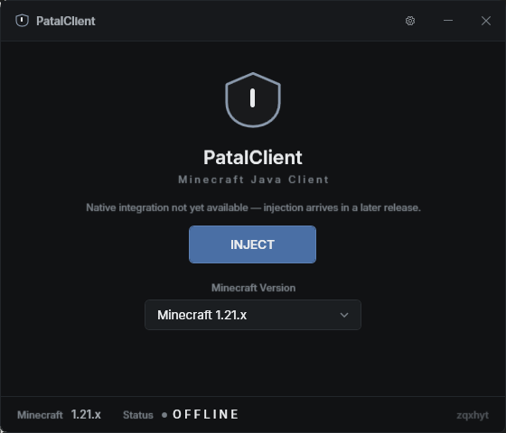

# PatalClient

A Minecraft: Java Edition client for Windows, targeting Minecraft 1.21+.
Developed by **zqxhyt**.



## Architecture

PatalClient is split into two independent components:

```
launcher/   C# / .NET 8 WPF launcher (this repository)
client/     C++ native client component (separate repository)
shared/     Contracts shared between launcher and client
```

The launcher never contains C++ code, and the client never depends on the
launcher. They communicate through a small native ABI that a future managed
bridge will wrap. The C++ client is developed independently and will live in
its own repository.

## Supported versions

| Version | Status |
|---------|--------|
| Minecraft 1.21.x | Registered — native client component not yet implemented |

## Building the launcher

Requirements: Windows x64 and the .NET 8 SDK.

```
cd launcher
dotnet build PatalClient.Launcher.sln -c Release
```

The executable is written to
`launcher/PatalClient.Launcher/bin/x64/Release/net8.0-windows/PatalClient.Launcher.exe`.

## Phase 1 status

Phase 1 delivers the launcher foundation only:

- Dark, minimal WPF launcher UI (logo placeholder, INJECT button, version selector)
- Bundled [Inter](https://rsms.me/inter/) typeface (SIL Open Font License, see
  `launcher/PatalClient.Launcher/Resources/Fonts/LICENSE-OFL.txt`) with a
  centralized typography system
- Launcher state model (Disconnected / Ready / Injecting / Active / Ejecting / Error)
- Version registry designed for adding new Minecraft versions without UI rewrites
- Settings window with General / Minecraft / Appearance / Updates / Account categories
- JSON configuration persisted under `%LOCALAPPDATA%\PatalClient`
- Leveled file logging under `%LOCALAPPDATA%\PatalClient\logs`
- Buildable C++ client skeleton maintained in its own repository

### Not yet implemented

- Actual Minecraft detection-driven injection is **not functional**. The
  INJECT button currently reports honestly that the native integration is
  unavailable; it never fakes success.
- No gameplay modules, rendering hooks, packet handling, authentication,
  licensing, update server, or telemetry.
- The launcher does not yet load the native client component; the ABI bridge
  is planned for Phase 2.

## Development status

Pre-release foundation work. See the phase plan in the repository for what
lands next.
